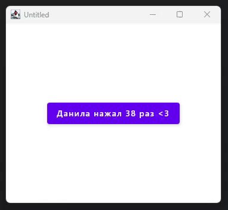

Цель: Освоить работу с состоянием (state) в Compose.
Создайте приложение с текстом и кнопкой. В тексте отображайте количество нажатий на кнопку.
Каждый раз при нажатии кнопки число в тексте должно увеличиваться на 1.
Подсказки: Используйте var с состоянием через mutableStateOf.

-----------------------------------------------------------------------------------------------------------------------------------

Добавил кнопку и при нажатии на него число увеличивается на 1. 
Так же сделал центрирование кнопки по центру используя Modifier и Alignment.

